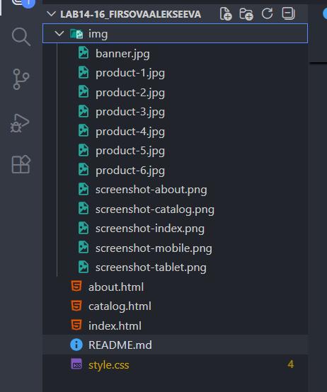
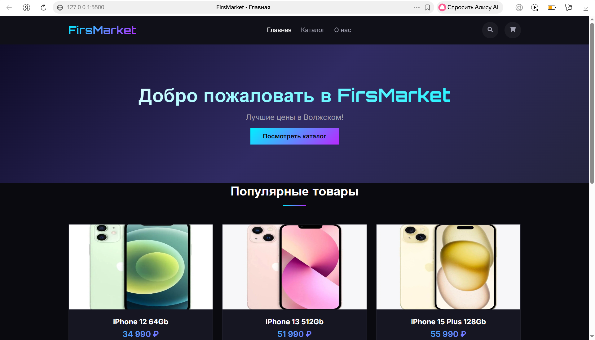
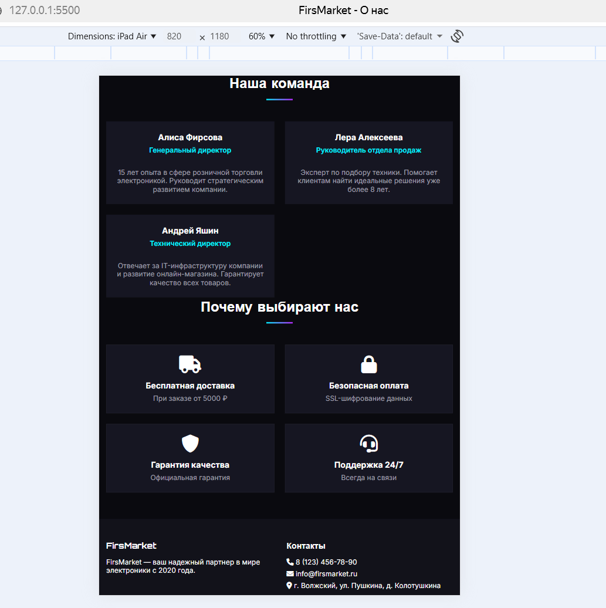
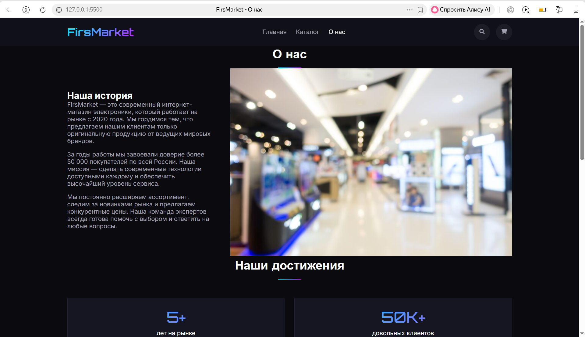

# Лабораторная работа №14-16 - Интернет-магазин "FirsMarket"

**ФИО:**  Фирсова Алиса Антоновна и Алексеева Валерия Денисовна
**Группа:** ИСП-232 
**Дата:** 25.03.2026

---

## Описание проекта

Многострайчный сайт интернет-магазина электроники "FirsMarket" с адаптивной вёрсткой. Проект создан с использованием современных технологий HTML5 и CSS3 (Flexbox, Grid, Media Queries). Сайт состоит из трех страниц: главной, каталога товаров и страницы "О нас".

---

## Реализованные страницы

### Главная
- Встречающий экран с описанием магазина и кнопкой перехода в каталог
- Блок с популярными позициями (три товара)
- Информационная панель о ключевых преимуществах сервиса

### Каталог
- Таблица из 9 позиций, сверстанная на Grid
- Карточка включает: фото, наименование, стоимость, рейтинг и клавишу добавления в корзину
- Анимация при наведении (подсветка, увеличение)

### О нас
- История создания и развития бренда
- Ключевые показатели в цифрах (опыт, клиенты, ассортимент)
- Профили команды с эмодзи вместо фото
- Список причин выбрать наш магазин

---

## Реализованные функции

| Функция | Описание |
|---------|----------|
| **Адаптивное навигационное меню** | Бургер-меню на мобильных устройствах, плавная анимация |
| **Карточки товаров с hover-эффектами** | Поднятие карточки, появление тени, масштабирование изображения |
| **CSS Grid для каталога** | Автоматическая адаптация колонок (3 → 2 → 1) |
| **Flexbox для навигации и футера** | Гибкое выравнивание элементов в шапке и подвале |
| **Адаптивная вёрстка** | Desktop (1200px+), Tablet (768px-1199px), Mobile (до 767px) |
| **Единая цветовая схема** | Использование CSS-переменных для основных цветов |
| **Семантическая HTML5-разметка** | Теги `<header>`, `<nav>`, `<main>`, `<section>`, `<footer>` |
| **Интерактивные элементы** | Кнопки с изменением цвета при наведении, активные пункты меню |
| **Кастомные иконки** | Использование Font Awesome для иконок соцсетей и преимуществ |

---

## Технологии

- **HTML5** — семантическая разметка страниц
- **CSS3**:
  - Flexbox — для навигации, футера, карточек команды
  - CSS Grid — для каталога товаров и секции преимуществ
  - Media Queries — для адаптации под все устройства
  - CSS Variables — для единой цветовой схемы
  - Transitions — для плавных hover-эффектов
- **Git/GitHub** — контроль версий и удаленный репозиторий
- **Font Awesome** — иконки для интерфейса

---

## Структура проекта

---

## Скриншоты

### 🖥️ Главная страница (Desktop)

### 📱 Каталог товаров (Tablet)

### 👥 Страница "О нас" (Mobile)

---

## Как запустить проект

### Способ 1: Простое открытие
1. Скопируйте репозиторий или скачайте архив
2. Откройте `index.html` в браузере (Chrome, Edge, Firefox)

### Способ 2: С использованием Live Server (рекомендуется)
1. Откройте папку проекта в редакторе (например, VS Code)
2. Установите расширение Live Server
3. Кликните правой кнопкой по `index.html` → "Open with Live Server"
4. Вкладка откроется автоматически, изменения будут видны сразу

---

## Результаты обучения

В ходе выполнения лабораторной работы я:
- Научился продумывать структуру многостраничника
- Освоил комбинацию Grid и Flexbox в одном проекте
- Закрепил понимание относительных единиц и медиазапросов
- Понял, как организовывать файлы и пути к изображениям
- Попрактиковался в написании чистого, читаемого CSS
- Связал страницы единой стилистикой и навигацией
- Попробовал управлять версиями через Git

---

© 2026 Фирсова, Алексеева | Лабораторная работа по веб-разработке